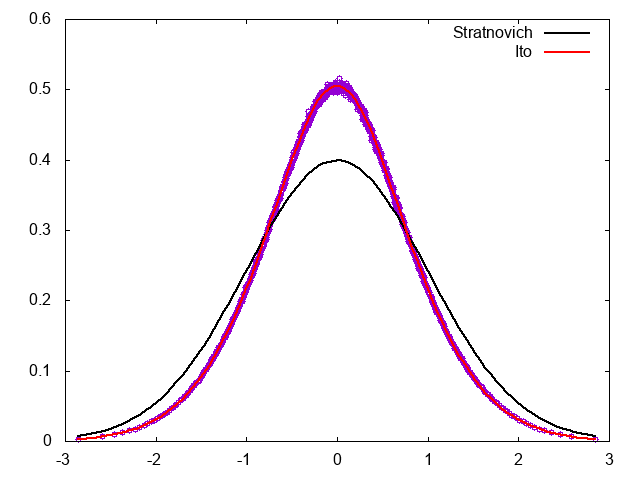
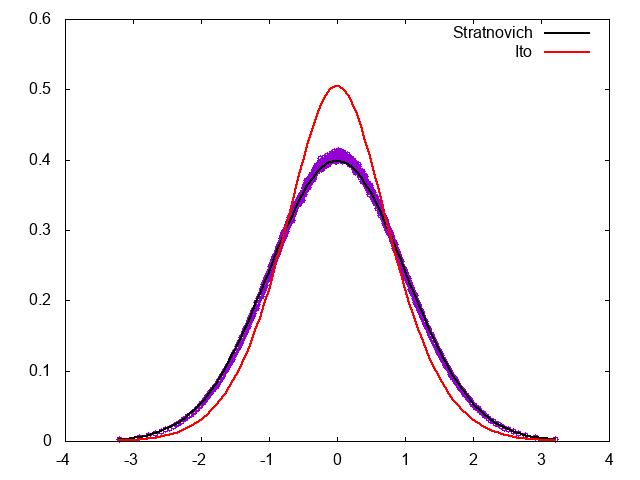

# Langevin Equation with Multiplicative Noise

## 実行方法

```sh
make
./a.out
make graph
```

## Additive Noise

以下のLangevin方程式を考える。

$$
\dot{x} = -x + \hat{R}
$$

ただし、$\hat{R}$は

$$
\left< \hat{R}(t_1) \hat{R}(t_2)\right> = 2 \delta(t_1-t_2)
$$

を満たす白色雑音である。

ノイズが加法的(additive)な場合、対応するFocker-Planck方程式はIto、Stratonovichともに同じ形になる。

$$
\frac{\partial f}{\partial t} = -\frac{\partial}{\partial x}
\left(
    -xf - \frac{\partial f }{\partial x}
\right)
$$

定常状態は$\partial f_{eq}/\partial t = 0$より、

$$
-xf_{eq} - \frac{\partial f_{eq} }{\partial x} =0
$$

以上から、

$$
f_{eq} = \frac{\mathrm{e}^{-x^2/2}}{\sqrt{2 \pi}}
$$

実際にシミュレーションしてみると、定常状態の分布関数はガウス分布に一致する。数値解法はEuler-Maruyama法を用いた。


## Multiplicative Noise

以下のLangevin方程式を考える。

$$
\dot{x} = -x^3 + x\hat{R}_1 + \hat{R}_2
$$

ただし、$\hat{R}_1,\hat{R}_2$は

$$
\begin{aligned}
\left< \hat{R}_1(t_1) \hat{R}_1(t_2)\right> &= 2 \delta(t_1-t_2) \\
\left< \hat{R}_1(t_1) \hat{R}_1(t_2)\right> &= 2 \delta(t_1-t_2) \\
\left< \hat{R}_1(t_1) \hat{R}_2(t_2)\right> &=0
\end{aligned}
$$

を満たす白色雑音であり、$\hat{R}_2$を加えたのは、$x=0$の時に$\dot{x} = 0$となってしまうのを防ぐためである。

ノイズが乗法的(multiplicative)な場合は、ItoとStratonovichでFocker-Planck方程式の形が変わる。

Stratonovichの場合

$$
\frac{\partial f}{\partial x} =
-\frac{\partial}{\partial x}\left(
-x^3 f - x \frac{\partial}{\partial x} (xf) - \frac{\partial f}{\partial x}
\right
)
$$

定常状態は、

$$
-x^3 f_{eq} - x f_{eq} - (x^2+1)f'_{eq} = 0
$$

より、

$$
f_{eq} = \frac{\mathrm{e}^{-x^2/2}}{\sqrt{2 \pi}}
$$

となる。

Itoの場合、

$$
\frac{\partial f}{\partial x} =
-\frac{\partial}{\partial x}\left(
-x^3 f -\frac{\partial}{\partial x} (x^2f) - \frac{\partial f}{\partial x}
\right
)
$$

定常状態は、

$$
f'_{eq} = -\frac{x^3+2x}{x^2+1} f_{eq}
$$

より、

$$
f_{eq} = C^{-1} \frac{\mathrm{e}^{-x^2/2} }{\sqrt{1+x^2}}
$$

となる。ただし$C\sim 1.98$である。

### Euler-Maruyama

先程のLangevin方程式をEuler-Maruyamaで計算すると、定常状態はItoに一致する。



### Two-step Method

運動方程式をTwo-step法で更新すると、Stratonovichに一致する。


### Milstein法

Two-step法に対応するMilstein法で更新すると、Stratonovichに一致する。



### Stratonovich + Euler-Maruyama

先程のLangevin方程式は、以下のようにしてStratonovich表現に変換できる。

$$
\dot{x} = -x^3 + x+ x\hat{R}_1 + \hat{R}_2
$$

に変形される。これをそのままEuler-Maruyama法で時間発展させた時の定常分布は、もとのLangevin方程式をStratonovich解釈した場合の定常分布に収束する。


## まとめ

確率微分方程式、特にノイズが変数依存性を持つようなmultiplicative noise系では、対応するFocker-Planck方程式がItoとStratonovichで異なる。Langevin方程式にEuler-Maruyama法を適用するとItoの分布に、Two-step法を適用するとStratonovichの分布に収束する。Two-step法に対応するMilstein法を用いると、Stratonovich解釈を採用したことになる。

## 謝辞と参考文献

産総研の中村さんにEuler-Maruyama法を、慶応義塾大学の巽さんにTwo-step法を教えていただきました。確率微分方程式の数値積分法とIto/Stratonovich解釈については、以下の論文が一番わかりやすかったです。

* [Stochastic algorithms for discontinuous multiplicative white noise](https://journals.aps.org/pre/abstract/10.1103/PhysRevE.81.032104), R. Perez–Carrasco and J. M. Sancho, Phys. Rev. E 81, 032104, doi:[10.1103/PhysRevE.81.032104](https://doi.org/10.1103/PhysRevE.81.032104)
