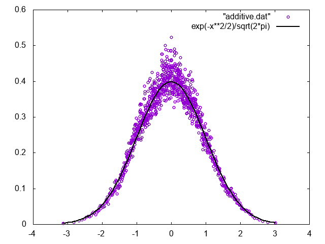

# Multiplicative Langevin Simulation

## 実行方法

```sh
make
./a.out
gnuplot additive.plt
gnuplot multiplicative.plt
```

## Additive Noise

以下のLangevin方程式を考える。

$$
\dot{x} = -x + \hat{R}
$$

ただし、$\hat{R}$は

$$
\left< \hat{R}(t_1) \hat{R}(t_2)\right> = 2 \delta(t_1-t_2)
$$

を満たす白色雑音である。

対応するFocker-Planck方程式は

$$
\frac{\partial f}{\partial t} = -\frac{\partial}{\partial x}
\left(
    -xf - \frac{\partial f }{\partial x}
\right)
$$

定常状態は$\partial f_{eq}/\partial t = 0$より、

$$
-xf_{eq} - \frac{\partial f_{eq} }{\partial x} =0
$$

以上から、

$$
f_{eq} = \frac{\mathrm{e}^{-x^2/2}}{\sqrt{2 \pi}}
$$

実際にシミュレーションしてみると、定常状態の分布関数はガウス分布に一致する。



## Multiplicative Noise

以下のLangevin方程式を考える。

$$
\dot{x} = -x^3 + x\hat{R}_1 + \hat{R}_2
$$

ただし、$\hat{R}_1,\hat{R}_2$は

$$
\begin{aligned}
\left< \hat{R}_1(t_1) \hat{R}_1(t_2)\right> &= 2 \delta(t_1-t_2) \\
\left< \hat{R}_1(t_1) \hat{R}_1(t_2)\right> &= 2 \delta(t_1-t_2) \\
\left< \hat{R}_1(t_1) \hat{R}_2(t_2)\right> &=0
\end{aligned}
$$

を満たす白色雑音であり、$\hat{R}_2$を加えたのは、$x=0$の時に$\dot{x} = 0$となってしまうのを防ぐためである。

対応するFocker-Planck方程式は、Stratonovichの場合

$$
\frac{\partial f}{\partial x} =
-\frac{\partial}{\partial x}\left(
-x^3 f - x \frac{\partial}{\partial x} (xf) - \frac{\partial f}{\partial x}
\right
)
$$

定常状態は、

$$
-x^3 f_{eq} - x f_{eq} - (x^2+1)f'_{eq} = 0
$$

より、

$$
f_{eq} = \frac{\mathrm{e}^{-x^2/2}}{\sqrt{2 \pi}}
$$

となる。

Itoの場合、

$$
\frac{\partial f}{\partial x} =
-\frac{\partial}{\partial x}\left(
-x^3 f - x^2 f' - f'
\right
)
$$

定常状態は、

$$
f'_{eq} = -\frac{x^3}{x^2+1} f_{eq}
$$

より、

$$
f_{eq} = C^{-1} \sqrt{1+x^2} \mathrm{e}^{-x^2/2}
$$

となる。ただし$C\sim 3.4$である。

実際にシミュレーションして定常状態を確認すると、上記の2つの分布のどちらにも一致しなかった。


